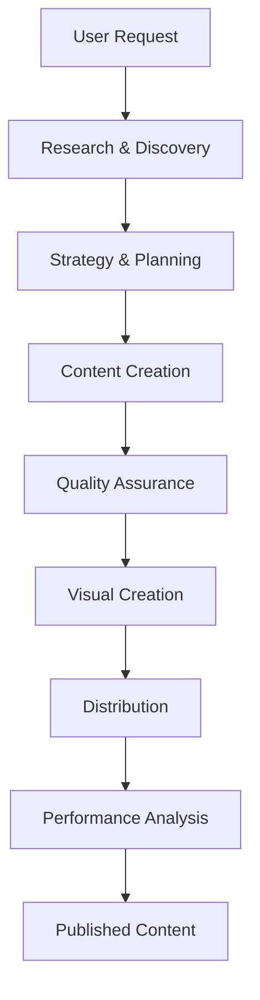

# Sub-Agent Pipeline Operational Guide
## Complete Usage Instructions for Intellidoc Content Creation System

**Version**: 2.0 (Optimized Pipeline)
**Date**: 2025-09-14
**Location**: `/subagents/writing_subagents_project/content_creation_subagents/content_subagent_files/non-optimized/optimized_versions/`

---

## Quick Start

### Basic Content Creation Command
```bash
# Start content creation for a blog post
claude --model opus
> Create a blog post about "AI automation tools for content creators"
```

The orchestrator will automatically invoke the appropriate sub-agents in sequence.

---

## Complete Workflow Overview



---

## Phase-by-Phase Operation

### Phase 1: Research & Discovery
**Purpose**: Gather information and identify opportunities

#### Agents & Sequence:
1. **topic-scout** → Identifies trending topics
2. **source-gatherer** → Collects 5-7 authoritative sources
3. **competitor-analyzer** → Analyzes competing content
4. **fact-verifier** → Validates claims and statistics
5. **keyword-researcher** → Identifies SEO opportunities

#### Example Invocation:
```bash
# Manual agent testing
claude --model sonnet
> Test topic-scout with {"niche": "AI content tools", "recent_performance": "tutorials +40%"}
```

#### Output Flow:
```json
topic-scout → {trending_topics, content_gaps}
    ↓
source-gatherer → {sources, key_points}
    ↓
competitor-analyzer → {gaps, differentiation}
    ↓
fact-verifier → {verified_facts}
    ↓
keyword-researcher → {keywords, search_volume}
```

---

### Phase 2: Strategy & Planning
**Purpose**: Define content strategy and specifications

#### Agents & Sequence:
1. **content-planner** → Creates editorial calendar
2. **angle-definer** → Determines unique perspective
3. **audience-profiler** → Defines target readers
4. **spec-writer** → Creates detailed specifications
5. **template-selector** → Chooses content structure

#### Pipeline Configuration:
```bash
# The orchestrator chains these automatically:
content-planner (opus) → angle-definer (sonnet) → spec-writer (opus)
```

#### Key Decision Points:
- Content type selection (blog/tutorial/news)
- Audience level (beginner/intermediate/expert)
- Word count targets (1500-2500 words)

---

### Phase 3: Content Creation
**Purpose**: Write the actual content

#### Agents & Sequence:
1. **outline-builder** → Creates structure
2. **intro-writer** → Crafts introduction
3. **body-writer** → Writes main sections
4. **conclusion-writer** → Creates closing
5. **quote-integrator** → Adds citations

#### Parallel Execution Opportunity:
```bash
# These can run simultaneously:
- intro-writer (after outline)
- body-writer (after outline)
- conclusion-writer (after body)
```

#### Quality Checkpoints:
- Hook effectiveness (first 50 words)
- Section transitions
- Source integration
- CTA clarity

---

### Phase 4: Technical Content (Optional Branch)
**Purpose**: Add technical elements for developer content

#### Agents & Sequence:
1. **code-example-writer** → Creates code snippets
2. **api-documenter** → Writes API docs
3. **command-demonstrator** → Shows CLI examples
4. **error-handler** → Documents troubleshooting

#### Activation Trigger:
```python
if content_type in ["tutorial", "technical", "api_guide"]:
    activate_technical_branch()
```

---

### Phase 5: Tutorial Creation (Optional Branch)
**Purpose**: Build learning experiences

#### Agents & Sequence:
1. **step-sequencer** → Orders learning steps
2. **exercise-designer** → Creates practice problems
3. **solution-provider** → Writes solutions
4. **concept-explainer** → Clarifies concepts

#### Integration Example:
```bash
# For tutorial content:
step-sequencer → exercise-designer → solution-provider
                ↓
        concept-explainer (parallel)
```

---

### Phase 6: Quality Assurance
**Purpose**: Ensure content quality and consistency

#### Agents & Sequence:
1. **grammar-checker** → Fix language errors
2. **style-editor** → Ensure brand voice
3. **flow-optimizer** → Improve structure
4. **readability-scorer** → Assess clarity
5. **link-validator** → Verify references

#### Parallel QA Pipeline:
```bash
# Run simultaneously:
grammar-checker (haiku) + link-validator (haiku)
    ↓
style-editor (sonnet) + readability-scorer (haiku)
    ↓
flow-optimizer (sonnet)
```

---

### Phase 7: Visual Creation
**Purpose**: Generate visual specifications

#### Agents & Sequence:
1. **ai-prompt-engineer** → Image prompts
2. **chart-designer** → Data visualizations
3. **infographic-planner** → Layout design
4. **thumbnail-creator** → Social thumbnails
5. **diagram-sketcher** → Technical diagrams

#### Visual Pipeline:
```bash
# Parallel visual generation:
ai-prompt-engineer → thumbnail-creator
chart-designer → infographic-planner
diagram-sketcher (standalone)
```

---

### Phase 8: Distribution
**Purpose**: Prepare content for multiple platforms

#### Agents & Sequence:
1. **content-atomizer** → Extract key points
2. **twitter-formatter** → Create threads
3. **linkedin-adapter** → Professional posts
4. **instagram-packager** → Visual content
5. **newsletter-curator** → Email format

#### Platform-Specific Flow:
```bash
content-atomizer → {
    twitter-formatter (haiku)
    linkedin-adapter (haiku)
    instagram-packager (haiku)
    newsletter-curator (sonnet)
} # All run in parallel
```

---

### Phase 9: Performance Analysis
**Purpose**: Track and optimize performance

#### Agents & Sequence:
1. **metrics-collector** → Gather data
2. **trend-spotter** → Identify patterns
3. **improvement-advisor** → Recommend changes

#### Feedback Loop:
```bash
metrics-collector (daily) → trend-spotter (weekly) → improvement-advisor (monthly)
                                                            ↓
                                                    topic-scout (feeds back)
```

---

## Common Workflows

### Workflow 1: Quick News Article (30 minutes)
```bash
Pipeline: 9 agents
1. topic-scout → source-gatherer → fact-verifier
2. spec-writer (simplified)
3. body-writer
4. grammar-checker
5. ai-prompt-engineer
6. content-atomizer → twitter-formatter

Models: 70% Haiku, 30% Sonnet
Cost: ~$0.024
```

### Workflow 2: Comprehensive Tutorial (90 minutes)
```bash
Pipeline: 18 agents
1. Full Research Phase (5 agents)
2. Full Strategy Phase (5 agents)
3. Content + Technical (7 agents)
4. Tutorial Branch (4 agents)
5. Full QA (5 agents)
6. Visuals + Distribution

Models: 20% Haiku, 60% Sonnet, 20% Opus
Cost: ~$0.075
```

### Workflow 3: Social Campaign from Existing (15 minutes)
```bash
Pipeline: 7 agents
Entry: content-atomizer (existing article)
1. content-atomizer
2. ai-prompt-engineer + thumbnail-creator
3. All social formatters (parallel)
4. metrics-collector

Models: 85% Haiku, 15% Sonnet
Cost: ~$0.009
```

---

## Manual Testing & Debugging

### Testing Individual Agents
```bash
# Test a specific agent
claude --model sonnet
> Test source-gatherer with {"topic": "AI automation", "angle": "solo creators"}

# Check agent output
> Show output from source-gatherer
```

### Testing Pipeline Segments
```bash
# Test research phase
> Run research pipeline for "content automation tools"

# Test just QA phase with existing content
> Run QA pipeline on [paste content]
```

### Debugging Failed Agents
```bash
# Check agent logs
cat shared-memory.json | jq .current_task

# Verify agent requirements
> Validate spec-writer input format

# Test with minimal input
> Test body-writer with basic outline only
```

---

## Configuration & Customization

### Pipeline Configuration File
Create `pipeline-config.json`:
```json
{
  "default_pipeline": "standard_blog",
  "pipelines": {
    "standard_blog": {
      "phases": ["research", "strategy", "content", "qa", "distribution"],
      "agents": {
        "research": ["topic-scout", "source-gatherer", "keyword-researcher"],
        "strategy": ["angle-definer", "spec-writer"],
        "content": ["outline-builder", "body-writer"],
        "qa": ["grammar-checker", "style-editor"],
        "distribution": ["content-atomizer", "twitter-formatter"]
      }
    },
    "quick_news": {
      "phases": ["research", "content", "distribution"],
      "time_limit": 30,
      "model_preference": "haiku"
    }
  }
}
```

### Model Selection Override
```bash
# Force specific models
CONTENT_MODEL=haiku claude
> Create article about [topic]

# Use cost-optimized pipeline
> Run economy pipeline for [topic]
```

---

## Performance Optimization

### Parallel Execution Strategy
```python
# Parallel groups for maximum efficiency
parallel_groups = [
    # Group 1: Research (can parallelize some)
    ["source-gatherer", "competitor-analyzer"],

    # Group 2: Content creation
    ["intro-writer", "body-writer"],

    # Group 3: QA checks
    ["grammar-checker", "link-validator", "readability-scorer"],

    # Group 4: Distribution
    ["twitter-formatter", "linkedin-adapter", "instagram-packager"]
]
```

### Token Usage Optimization
- Use Haiku for: formatting, validation, simple tasks
- Use Sonnet for: content creation, analysis
- Use Opus for: strategy, complex reasoning

### Cost Breakdown by Pipeline
| Pipeline | Agents | Tokens | Cost | Time |
|----------|--------|--------|------|------|
| Quick News | 9 | ~8,000 | $0.024 | 30 min |
| Blog Post | 12 | ~15,000 | $0.036 | 45 min |
| Tutorial | 18 | ~25,000 | $0.075 | 90 min |
| Social Only | 7 | ~3,000 | $0.009 | 15 min |

---

## Monitoring & Metrics

### Key Performance Indicators
```bash
# Check pipeline performance
> Show pipeline metrics for last 10 runs

# Monitor agent success rates
> Show agent reliability scores

# Track token usage
> Show token usage by agent type
```

### Success Metrics
- Pipeline completion rate: >95%
- Average time per article: <60 minutes
- Cost per 1000 words: <$0.02
- Quality score: >90%

---

## Troubleshooting Guide

### Common Issues & Solutions

#### Issue: Agent timeout
```bash
Solution: Break content into smaller chunks
> Set max_tokens=1000 for body-writer
```

#### Issue: Inconsistent voice
```bash
Solution: Strengthen style-editor constraints
> Update brand-voice guidelines in style-editor
```

#### Issue: Poor SEO optimization
```bash
Solution: Run keyword-researcher earlier
> Move keyword-researcher before spec-writer
```

#### Issue: High costs
```bash
Solution: Use more Haiku agents
> Switch formatters to haiku model
```

---

## Best Practices

### DO:
- ✅ Run research phase first for new topics
- ✅ Use parallel execution where possible
- ✅ Cache research results for similar topics
- ✅ Monitor performance metrics regularly
- ✅ Use appropriate models for each task

### DON'T:
- ❌ Skip the QA phase
- ❌ Use Opus for simple formatting
- ❌ Run all agents sequentially
- ❌ Ignore performance feedback
- ❌ Process without specifications

---

## Quick Reference

### Essential Commands
```bash
# Full pipeline
> Create blog post about [topic]

# Research only
> Research [topic] for content ideas

# QA existing content
> Review and optimize [paste content]

# Distribution only
> Create social posts from [article URL]

# Performance check
> Analyze last week's content performance
```

### Agent Model Map
```
Haiku: keyword-researcher, grammar-checker, readability-scorer,
       link-validator, command-demonstrator, solution-provider,
       thumbnail-creator, twitter-formatter, linkedin-adapter,
       instagram-packager, metrics-collector

Sonnet: Most agents (default choice)

Opus: content-planner, spec-writer, concept-explainer,
      improvement-advisor
```

---

## Integration with External Tools

### GitHub Integration
```bash
# Create PR with article
> Publish article as GitHub PR

# Update documentation
> Update docs with new tutorial
```

### CMS Integration
```bash
# Publish to WordPress
> Deploy article to WordPress

# Schedule publication
> Schedule article for tomorrow 9am
```

---

## Maintenance & Updates

### Weekly Tasks
- Review agent performance metrics
- Update trending topic sources
- Refresh competitor analysis

### Monthly Tasks
- Analyze content performance trends
- Update keyword strategies
- Refine agent prompts based on outputs

### Quarterly Tasks
- Full pipeline performance review
- Cost optimization analysis
- Agent prompt refinements

---

*This operational guide provides complete instructions for using the Intellidoc sub-agent pipeline system. For technical details about individual agents, see the agent definition files in `/optimized_versions/`.*