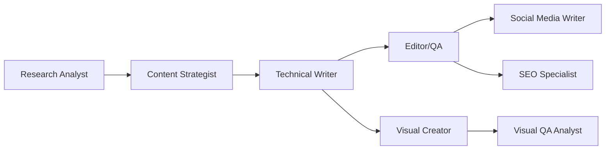

# Intellidoc Content Creation Sub-Agents

This directory contains the templates and sub-agent definitions for the Intellidoc automated content creation firm.

## 📋 Quick Start

1. **Use the Template**: Start with `SUBAGENT_POSITION_TEMPLATE.md` as your source of truth
2. **Follow the Example**: Review `research-analyst-EXAMPLE.md` to see proper implementation
3. **Create Your Agent**: Copy the template and fill in all sections
4. **Validate**: Use the checklist in the template to ensure completeness
5. **Deploy**: Save as `[agent-name].md` in this directory

## 📁 Directory Structure

```
content_creation_subagents/
├── README.md                           # This file
├── SUBAGENT_POSITION_TEMPLATE.md      # Master template (SOURCE OF TRUTH)
├── research-analyst-EXAMPLE.md        # Example implementation
└── [your-agents].md                   # Your sub-agent definitions
```

## 🎯 Implementation Priority

Based on the Intellidoc roadmap, implement agents in this order:

### Phase 1: MVP (Week 1-2)
1. ✅ Research Analyst (EXAMPLE PROVIDED)
2. ⏳ Technical Writer
3. ⏳ Editor/QA

### Phase 2: Expansion (Week 3-4)
4. ⏳ Content Strategist
5. ⏳ Social Media Writer
6. ⏳ Visual Creator

### Phase 3: Optimization (Week 5-6)
7. ⏳ Tutorial Creator
8. ⏳ News Writer
9. ⏳ Visual QA Analyst

### Phase 4: Scale (Week 7+)
10. ⏳ SEO Specialist
11. ⏳ Content Performance Analyst
12. ⏳ Learning Materials Designer

## 🛠️ How to Create a Sub-Agent

### Step 1: Choose Your Agent
Select from the positions defined in `subagent-positions.md`

### Step 2: Copy the Template
```bash
cp SUBAGENT_POSITION_TEMPLATE.md [agent-name].md
```

### Step 3: Fill in the Template
- Follow each section carefully
- Refer to the implementation report for best practices
- Use the Research Analyst example as a reference

### Step 4: Validate Your Agent
Use the checklist in the template:
- [ ] YAML frontmatter is valid
- [ ] All sections are complete
- [ ] Tools are appropriate
- [ ] Model selection is justified
- [ ] Integration points are clear

### Step 5: Test Your Agent
```bash
# Test with Claude Code
claude --model sonnet
> Test the [agent-name] agent with sample input
```

## 📊 Model Selection Guide

| Task Complexity | Model | Cost/M Tokens | Use Cases |
|----------------|--------|---------------|-----------|
| Simple | haiku | $0.80/$4 | Formatting, quick tasks |
| Standard | sonnet | $3/$15 | Content creation, editing |
| Complex | opus | $15/$75 | Strategy, deep analysis |

## 🔧 Available Tools

- `Read`: Read files and documents
- `Write`: Create and modify content
- `Search`: Search codebase/repository
- `Bash`: Execute commands
- `WebSearch`: Research topics online
- `WebFetch`: Retrieve web content
- `Grep`: Pattern matching
- `Glob`: File pattern matching

## 📈 Quality Standards

All sub-agents must maintain:
- **Magazine-quality output** (Wired, TechCrunch level)
- **Source verification** (5+ authoritative sources)
- **Brand consistency** (Voice and tone guidelines)
- **SEO optimization** (Without sacrificing readability)
- **Spec compliance** (100% adherence to requirements)

## 🔄 Integration Workflow



## 📝 Best Practices

1. **Single Responsibility**: Each agent does ONE thing well
2. **Clear Handoffs**: Define exact input/output formats
3. **Minimum Tools**: Only request necessary permissions
4. **Explicit Guardrails**: Define MUST and NEVER rules
5. **Measurable Metrics**: Include specific success criteria

## 🐛 Troubleshooting

### Common Issues

**Agent not triggering automatically**
- Add "PROACTIVELY" to the description
- Make description more action-oriented

**Token usage too high**
- Review model selection (downgrade if possible)
- Optimize prompt length
- Implement token limits

**Output quality issues**
- Add more specific examples
- Strengthen guardrails
- Clarify output format requirements

## 📚 Resources

- [Anthropic Sub-agents Docs](https://docs.anthropic.com/en/docs/claude-code/sub-agents)
- [Claude Code Best Practices](https://www.anthropic.com/engineering/claude-code-best-practices)
- Implementation Report: `/subagents/code/subagents-implementation-report.md`
- Position Descriptions: `/subagents/writing/content-creation-firm_Intellidoc-op/subagent-positions.md`

## 🤝 Contributing

1. Always start from the template
2. Document any template improvements
3. Share successful patterns with the team
4. Update this README with lessons learned

## 📊 Current Status

| Agent | Status | Model | Priority |
|-------|--------|-------|----------|
| Research Analyst | ✅ Example Created | sonnet | CRITICAL |
| Technical Writer | ⏳ Pending | opus/sonnet | HIGH |
| Editor/QA | ⏳ Pending | sonnet | CRITICAL |
| Content Strategist | ⏳ Pending | sonnet | CRITICAL |
| Social Media Writer | ⏳ Pending | haiku | HIGH |
| Visual Creator | ⏳ Pending | opus | HIGH |
| Tutorial Creator | ⏳ Pending | sonnet | HIGH |
| News Writer | ⏳ Pending | haiku | MEDIUM |
| Visual QA Analyst | ⏳ Pending | sonnet | MEDIUM |
| SEO Specialist | ⏳ Pending | haiku | MEDIUM |
| Content Performance Analyst | ⏳ Pending | sonnet | LOW |
| Learning Materials Designer | ⏳ Pending | sonnet | LOW |

---

*Last Updated: 2024-09-14*
*Version: 1.0.0*